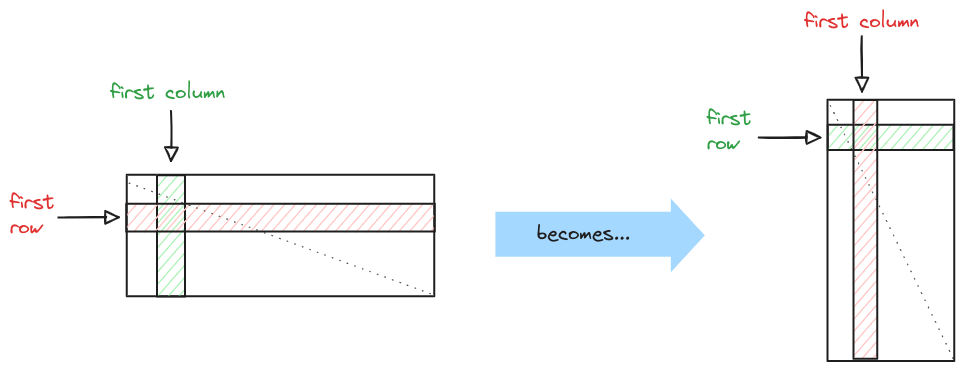

# Matrix transposition : from sequential to parallel with CUDA

The following repository contains all the material related to both the homeworks on **Matrix Transposition** assigned during the GPU computing course : University of Trento (Italy) a.y. 2023/2024.
<br>

To see the report and better understand what this work is about, click [**Here**](materials/LC-GPU_computing-report.pdf)



<br>

## How to use

Download the directory
```
git clone https://github.com/LuCazzola/cudaMatrixTranspose.git
cd cudaMatrixTranspose
```
<br>


Here follows the Hierarchy of relevant project's files :
```bash

.
├── bin                         # final executables
│    └── ...
├── obj                         # intermediate object files
│    └── ...
└── src                         # source code
│    ├── headers                # header files
│    │    └── ...                         
│    ├── benchmark.c            # produce an output file according to options in "run_benchmark.sh"
│    ├── benchmark_gpu.cu       # produce an output file according to options in "launch_benchmark.sh"
│    .
│    ├── main.c                 # test the functions according to options in "run_main.sh"
│    ├── main_gpu.cu            # test the functions according to options in "launch_main.sh"
│    .
│    ├── transpose.c            # functions to compute the transpose of a given matrix
│    ├── transpose_gpu.c 
│    .
│    ├── matrix.c               # definition of methods to handle matrices
│    ├── opt_parser.c           # command line parameter parsing
│    .
│    └── common_cuda.cu         # defines some common functions for cuda methods
│
├── run_benchmark.sh            # set parameters related to "benchmark.c" and run the script
├── run_main.sh                 # set parameters related to "main.c" and run the script
├── run_cache_benchmark.sh      # run cachegrind to benchmark cache miss % on specified function
│   .
├── launch_benchmark.sh         # set parameters related to "benchmark_gpu.cu" and run the script on SLURM system
├── launch_main.sh              # set parameters related to "main_gpu.cu" and run the script on SLURM system
│   .
├── data                        # data gathered via "run_benchmark.sh" & "launch_benchmark.sh"
│    └── ...
├── plot_data.py                # generates graphs using the data stored in "data" folder
│
├── Makefile
└── ...
```
<br>

### Main commands

Makefile defines 4 rules :
* **make** : builds object files and **homework-1 + homework-2** executables
* **make debug** :  builds object files and ALL executables adding debugging flags
* **make benchmark** : builds object files and **benchmark + benchmark_gpu** executable
* **make clean** : cleans all object files

<hr><br>

## CPU test commands (Homework-1)

**"run_main.sh"** script sets **parameters** related to **homework-1** executable and runs it
<br>
To [change run parameters](run_main.sh?plain=1#L12-L19) and have a better understanding of its functionalities see : [**run_main.sh**](run_main.sh?plain=1#L3-L9)
```
make
./run_main.sh
```

<br>

**"run_benchmark.sh"** script sets **parameters** related to **benchmark** executable and runs it
<br>
extracted data can be found on the [**data folder**](data/)
<br>
To [change run parameters](run_benchmark.sh?plain=1#L20-L28) and have a better understanding of its functionalities see : [**run_benchmark.sh**](run_benchmark.sh?plain=1#L3-L17)
```
make benchmark
./run_benchmark.sh
```

<br>

**"run_cache_benchmark.sh"** script sets **parameters** related to **homework-1** and runs Cachegrind on it, extracting localized informations about cache misses inside transpose_naive() or transpose_blocks() functions (according to the chosen parameter "method")
<br>
To [change run parameters](run_cache_benchmark.sh?plain=1#L18-L25) and have a better understanding of its functionalities see : [**run_cache_benchmark.sh**](run_cache_benchmark.sh?plain=1#L3-L15)
```
make clean
make debug
./run_cache_benchmark.sh
```
<hr>

## GPU test commands (Homework-2)

**"launch_main.sh"** script sets **parameters** related to **homework-2** executable and runs it
<br>
To [change run parameters](launch_main.sh?plain=1#L26-L37) and have a better understanding of its functionalities see : [**run_main.sh**](launch_main.sh?plain=1#L17-L23)
```
make
sbatch launch_main.sh
```
Then as the job ends:
```
cat output.out
```
<br>

**"launch_benchmark.sh"** script sets **parameters** related to **benchmark_gpu** executable and runs it
<br>
extracted data can be found on the [**data folder**](data/)
<br>
To [change run parameters](launch_benchmark.sh?plain=1#L35-L49) and have a better understanding of its functionalities see : [**run_benchmark.sh**](launch_benchmark.sh?plain=1#L16-L30)
```
make benchmark
sbatch launch_benchmark.sh
```
Then as the job ends:
```
cat output.out
```


<hr><br>

It's also possible to change some other parameters at compilation level (optimization level and matrix element data type) by changing some [**variables in the makefile**](Makefile?plain=1#L3-L6)) :

